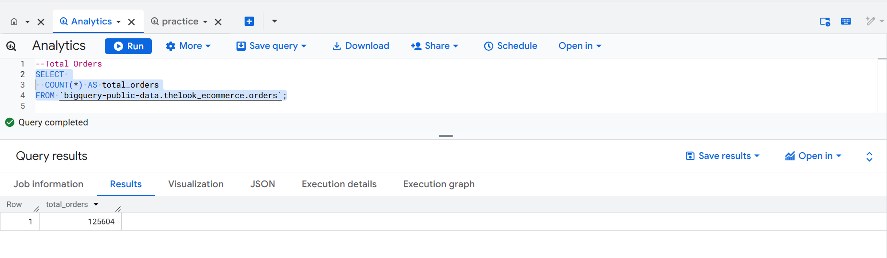
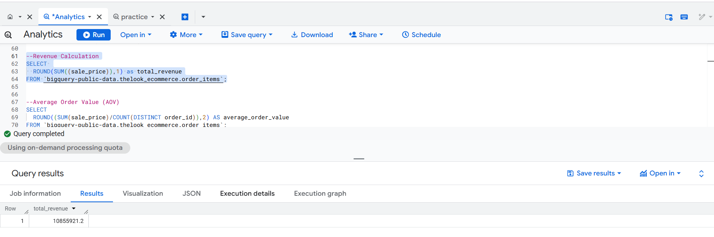
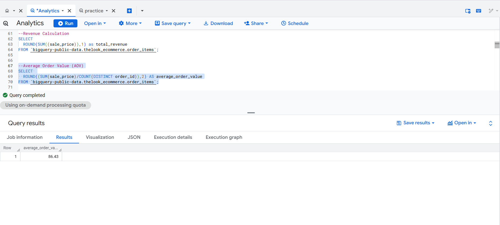
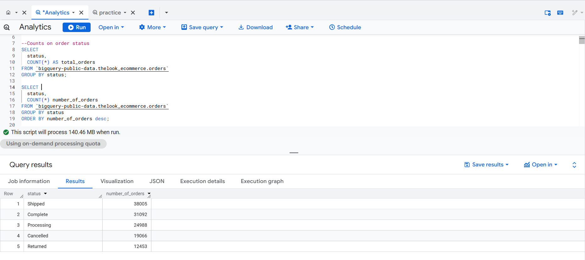
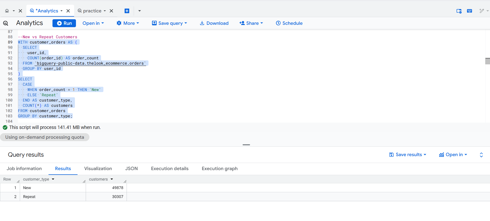
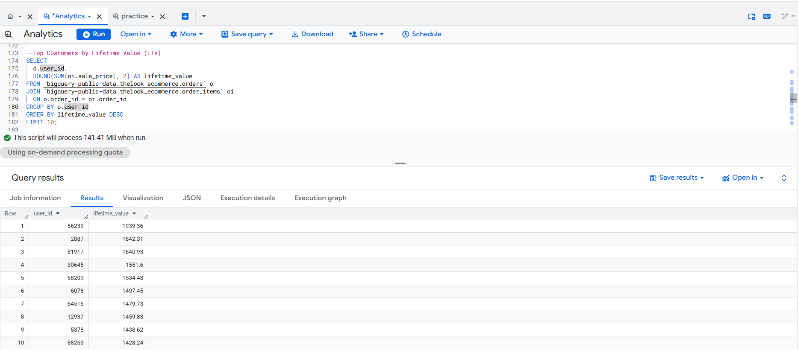
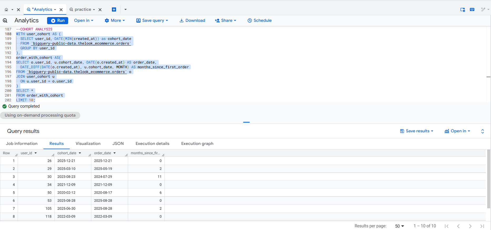

# E-Commerce Analytics with Google BigQuery


> **Transforming raw e-commerce transaction data into actionable business intelligence using cloud-scale SQL on Google BigQuery.**

---

## What This Project Does

This project answers the real business questions every e-commerce team cares about — revenue health, customer retention, purchase patterns, and where buyers drop off. Built entirely in **BigQuery SQL** using the public `thelook_ecommerce` dataset, it simulates a real analyst workflow across three focused analytical layers.

---

## Dataset

**Source:** `bigquery-public-data.thelook_ecommerce`

A realistic, large-scale e-commerce dataset hosted on Google BigQuery containing:
- Orders and order items with pricing
- User events (product views, cart adds, purchases)
- Customer-level purchase history

---

## Analysis Breakdown

### Module 1 — Business Health Metrics
**File:** [exploratory_business_metrics.sql](exploratory_business_metrics.sql)

| Analysis | Technique |
|---|---|
| Order status distribution | `GROUP BY` + `COUNT` |
| Revenue & Average Order Value (AOV) | `SUM`, `COUNT DISTINCT` |
| Monthly & yearly order trends | `FORMAT_DATE`, `EXTRACT` |
| Gender-based order split | Aggregation |

**Key Query Pattern:**
```sql
SELECT
  ROUND(SUM(sale_price) / COUNT(DISTINCT order_id), 2) AS average_order_value
FROM `bigquery-public-data.thelook_ecommerce.order_items`;
```

---

### Module 2 — Customer Behavior & Lifetime Value
**File:** [customer_behavior.sql](customer_behavior.sql)

| Analysis | Technique |
|---|---|
| New vs Repeat customer segmentation | `CASE WHEN`, CTEs |
| Repeat purchase rate | Conditional aggregation |
| Days between 1st and 2nd purchase | `ROW_NUMBER()`, `DATE_DIFF` |
| Top 10 customers by Lifetime Value (LTV) | `JOIN`, `ORDER BY` |

**Key Query Pattern:**
```sql
WITH ordered_purchases AS (
  SELECT
    user_id,
    created_at,
    ROW_NUMBER() OVER (PARTITION BY user_id ORDER BY created_at) AS order_seq
  FROM `bigquery-public-data.thelook_ecommerce.orders`
)
SELECT
  user_id,
  DATE_DIFF(
    MAX(CASE WHEN order_seq = 2 THEN DATE(created_at) END),
    MAX(CASE WHEN order_seq = 1 THEN DATE(created_at) END),
    DAY
  ) AS days_between_first_second
FROM ordered_purchases
GROUP BY user_id
HAVING days_between_first_second IS NOT NULL;
```

---

### Module 3 — Cohort Retention & Conversion Funnel
**File:** [cohort_funnel.sql](cohort_funnel.sql)

| Analysis | Technique |
|---|---|
| Monthly cohort retention matrix | Multi-CTE, `DATE_DIFF` by MONTH |
| Funnel: Product view → Cart → Purchase | `MAX(CASE WHEN)`, `COUNTIF` |
| Step-by-step conversion rates | Derived percentage calculations |

**Key Query Pattern:**
```sql
WITH user_cohort AS (
  SELECT user_id, DATE(MIN(created_at)) AS cohort_date
  FROM `bigquery-public-data.thelook_ecommerce.orders`
  GROUP BY user_id
),
orders_with_cohort AS (
  SELECT o.user_id, u.cohort_date,
    DATE_DIFF(DATE(o.created_at), u.cohort_date, MONTH) AS months_since_first_order
  FROM `bigquery-public-data.thelook_ecommerce.orders` o
  JOIN user_cohort u ON o.user_id = u.user_id
)
SELECT
  FORMAT_DATE('%Y-%m', cohort_date) AS cohort_month,
  months_since_first_order,
  COUNT(DISTINCT user_id) AS active_users
FROM orders_with_cohort
GROUP BY cohort_month, months_since_first_order
ORDER BY cohort_month, months_since_first_order;
```

---

## Key Business Insights

### Revenue & Orders
- The business processes a high volume of orders across multiple years, confirming a **mature e-commerce operation**
- AOV is a reliable revenue lever — cross-sell and bundling strategies could directly improve it without increasing traffic

### Customer Behavior
- **Majority of customers are one-time buyers** — the business is acquisition-heavy, not retention-driven
- A **small segment of high-LTV customers drives a disproportionate share of revenue** — protecting and growing this segment is critical

### Funnel & Retention
- **Biggest drop-off: product views → cart** — suggests friction in pricing, product clarity, or UX
- Cohort retention falls sharply after Month 0, with no strong improvement across newer cohorts — **post-purchase engagement is a growth lever**

---

## Sample Outputs

### Total Orders & Revenue
<p align="center">
  
  
</p>

### Average Order Value & Order Status
<p align="center">
  
  
</p>

### Customer Segmentation & Top LTV Customers
<p align="center">
  
  
</p>

### Cohort Retention Matrix
<p align="center">
  
</p>

---

## SQL Skills Demonstrated

| Skill | Used In |
|---|---|
| Common Table Expressions (CTEs) | All modules |
| Window Functions (`ROW_NUMBER`, `PARTITION BY`) | Customer Behavior |
| Conditional Aggregation (`CASE WHEN`, `COUNTIF`) | All modules |
| Date functions (`DATE_DIFF`, `FORMAT_DATE`, `EXTRACT`) | All modules |
| Multi-table JOINs | LTV, Cohort Analysis |
| Funnel Analysis | Cohort & Funnel module |
| Cohort Analysis | Cohort & Funnel module |

---

## Project Structure

```
bigquery-ecommerce-analytics/
│
├── exploratory_business_metrics.sql   # Revenue, AOV, order trends
├── customer_behavior.sql              # Segmentation, LTV, repeat rates
├── cohort_funnel.sql                  # Cohort retention + conversion funnel
│
├── insignts/
│   ├── exploratory_matrics_insights.md
│   ├── customer_behavior_value_Insights.md
│   └── cohort_funnel_insights.md
│
└── screenshot/                        # Query output screenshots
```

---

## How to Run

1. Open [Google BigQuery Console](https://console.cloud.google.com/bigquery)
2. No setup needed — `bigquery-public-data.thelook_ecommerce` is publicly available
3. Copy and run any `.sql` file directly in the BigQuery editor

---

## Tools & Technologies

- **Google BigQuery** — Cloud-scale SQL execution
- **Standard SQL** — Window functions, CTEs, conditional aggregation
- **TheLook Ecommerce** — Public BigQuery dataset simulating real retail data

---

## What I Learned

**Technically:**
- How to structure multi-layer CTE queries that stay readable and maintainable at scale
- Using `ROW_NUMBER()` with `PARTITION BY` to sequence purchases per customer — a pattern that unlocks a lot of behavioral analysis
- Building cohort matrices entirely in SQL without any external tools, using `DATE_DIFF` by month as the retention axis
- Thinking in funnels: how to pivot event-level data into user-level boolean flags using `MAX(CASE WHEN)` for clean funnel counts

**As an Analyst:**
- Framing analysis around business questions first, not just "what can I query" — every module started with a question, not a table
- Retention and acquisition are two sides of the same problem — high acquisition numbers can mask a broken retention story
- The funnel drop-off between product view and cart is rarely just a data problem — it points to product, pricing, or UX decisions worth investigating
- High-LTV customer concentration is both a risk (dependency) and an opportunity (targeted retention investment)

---

## Challenges Faced

| Challenge | How I Solved It |
|---|---|
| Calculating days between purchases per user | Used `ROW_NUMBER()` to tag order sequence, then pivoted with `MAX(CASE WHEN order_seq = N)` |
| Building cohort retention without a BI tool | Computed `DATE_DIFF` in months between each order and user's first order date using multi-step CTEs |
| Avoiding double-counting in funnel analysis | Aggregated to user level first with `MAX(CASE WHEN event_type = ...)` before counting funnel steps |
| Keeping queries readable as complexity grew | Broke logic into named CTEs with one responsibility each, rather than nesting subqueries |

---

*Built to demonstrate real-world data analyst skills: asking the right business questions, writing production-quality SQL, and translating query results into actionable recommendations.*
